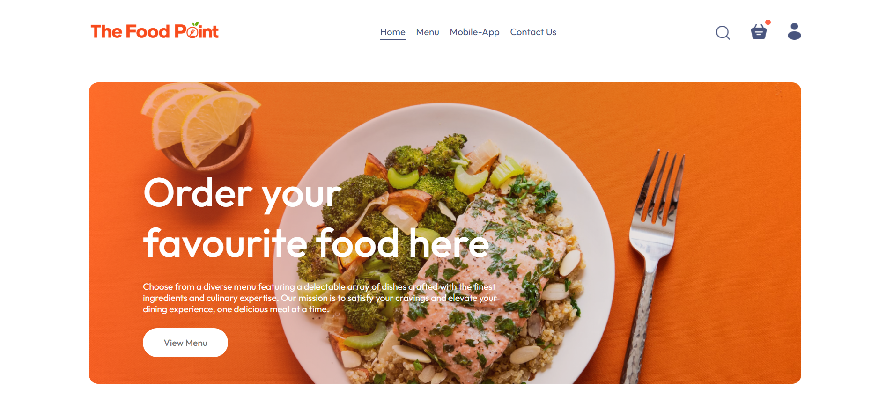
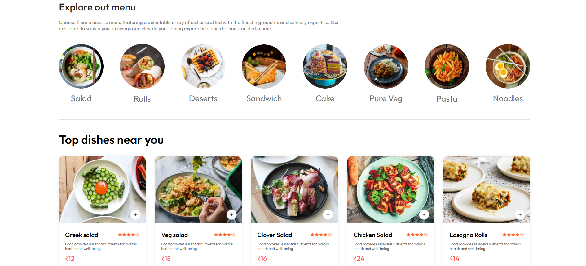
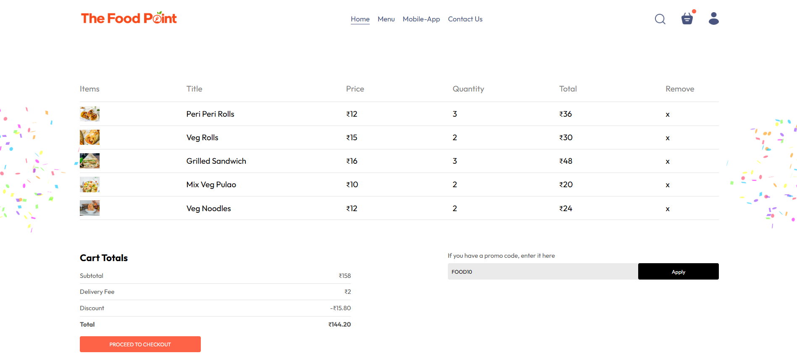
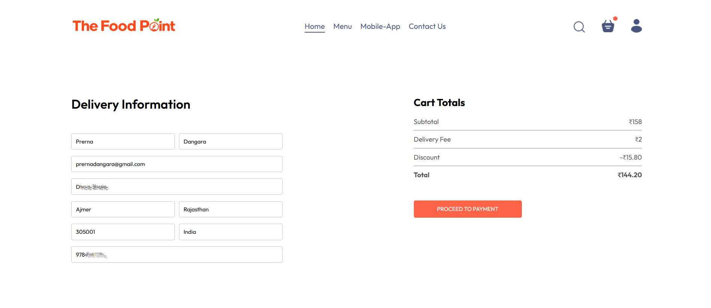
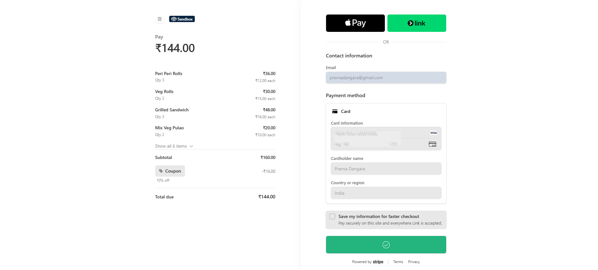
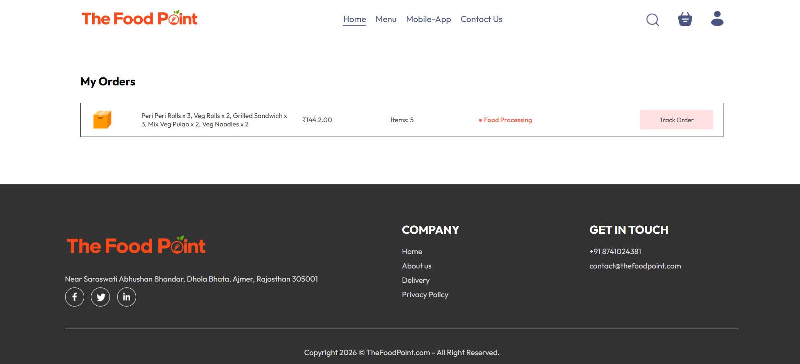
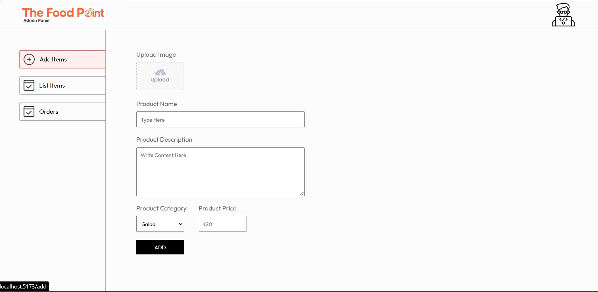
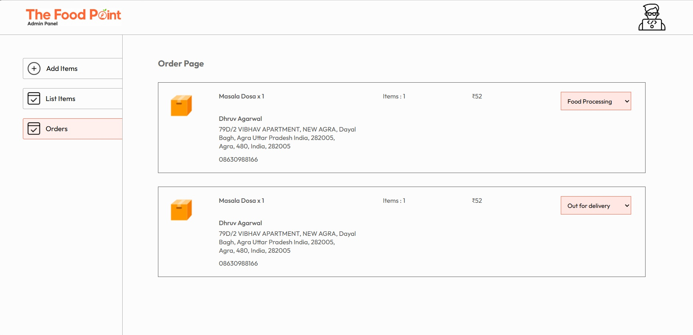

# 🍔 The Food Point — Full-Stack Food Ordering Platform

A full-stack food ordering platform built with **React, Node.js, Express, MongoDB, and Stripe**. The application provides a customer-facing storefront for browsing and ordering food, along with a dedicated admin dashboard for menu and order management.

The system implements **JWT authentication, cart management, promotional discounts, image uploads, Stripe Checkout, order processing, and order status tracking** through a shared REST API.

---

## ✨ Features

**Customer App**
- Browse menu by category with a responsive food catalog
- Add/remove items from cart with live cart total
- Promotional coupon support with `FOOD10` for 10% off
- User registration & login (JWT-based authentication, hashed passwords via bcrypt)
- Secure checkout with **Stripe** payment integration
- Order history and order status tracking

**Admin Panel**
- Add new food items with image upload
- View and remove existing menu items
- View all incoming orders
- Update order status (Processing → Out for Delivery → Delivered)

---

## 🛠️ Tech Stack

| Layer | Technology |
|---|---|
| **Frontend** | React 19, React Router, Axios, React Toastify, Vite |
| **Admin Panel** | React 19, Axios, Vite (separate app) |
| **Backend** | Node.js, Express 5, Mongoose (MongoDB) |
| **Auth** | JWT, bcrypt for password hashing |
| **Payments** | Stripe Checkout |
| **File Uploads** | Multer |
| **Database** | MongoDB (Atlas) |

---

## 📁 Project Structure

```
the-food-point/
├── frontend/     # Customer-facing React app
├── admin/        # Admin dashboard React app
├── backend/      # Express REST API + MongoDB models
└── screenshots/  # Project screenshots
```

The project separates the customer application and admin dashboard into two React applications that communicate with a shared backend API.

---

## ⚙️ Getting Started

### Prerequisites
- Node.js (v18+)
- A MongoDB Atlas connection string
- A Stripe account (test mode keys work fine for local dev)

### 1. Clone the repo
```bash
git clone https://github.com/prernadangara/the-food-point.git
cd the-food-point
```

### 2. Backend setup
```bash
cd backend
npm install
```
Create a `.env` file inside `/backend`:
```
JWT_SECRET=your_jwt_secret
STRIPE_SECRET_KEY=your_stripe_secret_key
MONGODB_URI=your_mongodb_connection_string
```
```bash
npm run server
```

### 3. Frontend setup
```bash
cd ../frontend
npm install
npm run dev
```

### 4. Admin panel setup
```bash
cd ../admin
npm install
npm run dev
```

---

## 🔐 Environment Variables

This project requires a `.env` file in `/backend`, which is excluded from version control through `.gitignore`. Never commit real credentials or API keys.

---

## 🗺️ Future Improvements

- [ ] Add authentication/authorization middleware to admin-only routes (currently open)
- [ ] Server-side price validation at checkout (currently trusts client-submitted price)
- [ ] Verify payment status via Stripe webhook instead of client-reported success
- [ ] Add automated tests (Jest/React Testing Library)
- [ ] Deploy live demo (Render/Vercel)
- [ ] Add order search & filtering in admin panel

---

## 📸 Screenshots

### Customer Application

#### Home & Food Catalog



#### Menu Categories



#### Shopping Cart



#### Checkout



#### Successful Stripe Payment



#### Order History & Tracking



### Admin Panel

#### Add Food Items



#### Order Management



---

## 📄 License

This project is developed for educational and portfolio purposes. The application, source code, and project materials are provided for demonstration and learning purposes.

---

## 🙋 About This Project

The Food Point is a full-stack application designed to demonstrate the implementation of a complete food ordering workflow, from product discovery and cart management to payment processing and order tracking.

The project brings together a React-based customer interface, a dedicated admin dashboard, and a Node.js/Express REST API backed by MongoDB, with Stripe integrated for payment processing.
